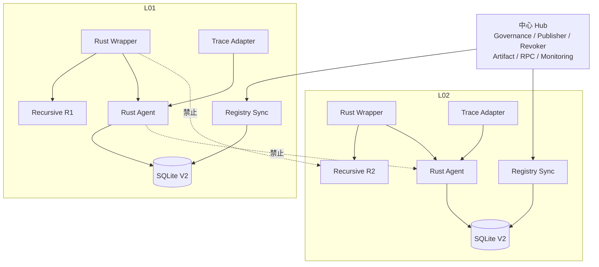

# 星形域名中心实地部署方案（Rust V2）

## 1. 拓扑原则

中心 Hub 负责身份治理、分角色发布、制品分发、只读 RPC、监控、日志和备份。
L01、L02、L03 各自是独立验证单元，不组成 Agent 全互联网络。

每条链路从 `deploy/link/docker-compose.yml` 生成独立部署实例，使用独立 `.env`、
TLS 证书、Agent 私钥、Wrapper/peer/Trace token、volume 和主机防火墙规则。
如果同一主机部署多个 DNS 服务，每个实例必须使用不同 Compose project name、
`AGENT_PORT`、metrics 端口和 `RI_TRACE_SOCKET_HOST_DIR`。

## 2. 链路类型

### 2.1 R1 直接迭代

R1 的内部 Trace 必须记录它实际访问的 Root、TLD 和 Authority。R1 Agent 直接
形成多条观察边，不要求这些服务彼此或不同链路的递归解析器通信。

### 2.2 R1 转发给同链路 R2

R1、R2 分别部署 Agent。只放通 R1 Agent 到 R2 Agent 的 mTLS 服务端口；R1
Resolver 到 R2 Resolver 的 DNS 通信必须原本就属于该链路。R2 identity 的
`agent.service_url` 必须是 R1 主机可解析、可校验证书且经过防火墙放行的管理网地址，
不能使用只在另一 Compose 网络内有效的 `https://agent:8443`。R2 子图逐级返回。

### 2.3 R1 指向另一隔离链路的 R2

如果现场规则禁止 L01 和 L02 之间的 Resolver 与 Agent 通信，则不能把 R2 声明为
terminal 绕过验证。必须调整 DNS 拓扑使递归在本链路闭合，或把该链路判定为未达到
切流条件。

## 3. 防火墙矩阵

默认拒绝未列出的通信：

| 源 | 目的 | 协议 | 说明 |
| --- | --- | --- | --- |
| 本链路客户端 | Wrapper | UDP/TCP 53 | DNS 入口 |
| Wrapper | 本链路 R1 | UDP/TCP 53 | DNS 数据面 |
| Wrapper | 本链路 Agent | TCP 8443 mTLS | 证据图 |
| Trace Adapter | 本链路 Agent | TCP 8443 mTLS | Trace 批量摄入 |
| Agent | 同一实际链的相邻 Agent | TCP 8443 mTLS | 响应证明/子图 |
| Registry Sync | 中心只读 RPC | TCP 443 TLS | finalized 状态读取 |
| 监控采集器 | Wrapper metrics | TCP 9108 | 只允许管理网 |
| 监控采集器 | Registry/Trace metrics | TCP 9109/9110 | 只允许管理网 |
| 监控采集器 | Agent `/metrics` | TCP 8443 mTLS | 使用专用客户端证书 |
| 链路日志代理 | 中心日志平台 | TCP 443/6514 TLS | 单向汇聚 |
| 堡垒机 | 链路主机 | TCP 22 | 运维入口 |

明确禁止 L01 到 L02 的 Resolver、Agent、SQLite、Admin 和 metrics 任意访问。

## 4. 节点部署

每个需要认证的受控 DNS 服务旁放置：

- 一份唯一 `DnsServerIdentityV2`；
- 一把唯一 Agent Ed25519 私钥；
- 一个只监听管理网的 Agent mTLS 服务；
- 一个能从解析器内部上下文生成 `TraceEventV2` 的生产者；
- 一个本机 Trace Adapter。

公共 Root/TLD/Authority 不由本方部署 Agent，使用 `public-hybrid`。身份对象描述
服务和 Anycast 边界，不描述无法证明的物理实例。

## 5. 配置和密钥

链路主机允许保存：

- 本链路 Agent 私钥；
- Wrapper、Trace Adapter、Agent 的 mTLS 私钥；
- Trace ingest token；
- 本地 Wrapper token 和仅限本实际 DNS 链的 peer Agent token；
- issuer 公钥包；
- 签名 identity artifact；
- 只读 RPC 地址和固定的 chain ID/address/code hash。

链路主机禁止保存：

- Governance Admin、Root Publisher、Resolver Publisher 私钥；
- Endpoint Manager、Revoker 私钥；
- issuer 私钥；
- 具有 Registry 写权限的 RPC 凭据。

## 6. 现场切流顺序

1. 记录链路 ID、R1/R2 配置、Root/TLD/Authority 访问方式和终止边界；
2. 在不切客户端流量时部署 Trace 生产者，核对并发相同报文下 `trace_id`、
   `correlation_id` 和 `target_correlation_id` 不串线；
3. 生成并签名 V2 identity artifact；
4. 各角色对同一 plan hash 依次执行 Root、Resolver、旧 Endpoint 解绑、新 Endpoint
   绑定和移除 Resolver 撤销；
5. 两人分别核验 chain ID、contract address 和 runtime code hash；
6. 启动 Registry Sync，确认所有身份进入 `ACTIVE/MATCHED`；
7. 启动 Agent 和 Trace Adapter，完成 mTLS、三类 token 交叉拒绝、错误证书、撤销
   和 Agent 环路测试；
8. 启动 Wrapper shadow 流量，比较 DNS 响应和 `SERVFAIL` 原因；
9. 执行峰值 QPS、最大链深、缓存冷/热和 RPC/Agent 故障容量测试；
10. 完成 evidence/Trace spool SQLite 在线备份、异机恢复、续传和哈希核验；
11. 仅当生产门禁全部通过时，按 1% -> 10% -> 50% -> 100% 切流。

任何阶段可将客户端 DNS VIP 切回原解析器入口；回滚不撤销身份。疑似密钥泄露时由
独立 Revoker 撤销对应 resolver/root，不能用普通版本回滚恢复已永久撤销对象。
