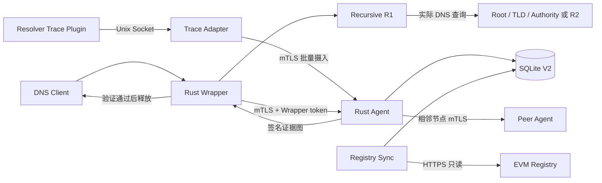

# DNS 全路径服务身份认证系统技术介绍

## 1. 项目定位

本项目在不修改客户端 DNS 报文格式的前提下，验证一次查询实际使用的 DNS 服务
身份，再决定是否向客户端释放原始 DNS 响应。验证对象包括：

- 客户端直接使用的递归解析器；
- 递归链中的转发器或下游递归解析器；
- 实际被访问的 Root、TLD 和 Authoritative 服务。

系统认证的是“本次查询实际经过的 DNS 服务是否已登记、端点是否匹配、当前是否
有效，以及受控服务是否确实观察到对应响应”。它不证明已合法登记的解析器一定没有
被攻陷，也不替代 DNSSEC 对 DNS 数据来源和完整性的验证。

生产查询数据面已经使用 Rust 实现。Python 代码保留在低频管理面、合约发布和历史
兼容测试中，不再承担 V2 DNS 查询热路径。

## 2. 总体架构

一次查询包含两类信息流：

1. DNS 数据流：Wrapper 把请求转发给本链路递归解析器并暂存返回结果；
2. 身份证据流：Resolver 内部插件生成实际查询事件，Agent 根据事件构建并签名
   `QueryEvidenceGraphV2`。

Wrapper 只有在 DNS 响应结构、证据图、签名、DNSSEC 策略和本地独立 Registry
快照全部通过时才返回原始响应。任一环节失败均返回 `SERVFAIL`。

## 3. 实际查询与证据绑定

系统不再依靠静态配置猜测固定的 `R1 -> R2 -> R3` 链路。路径由 Resolver 本次查询
产生的实际 Trace 决定。

1. Wrapper 校验 DNS 请求，并分配当前活动请求唯一的内部 transaction ID；
2. Wrapper 根据清零 transaction ID 后的 wire digest 生成 `correlation_id`；
3. Wrapper 在 SQLite 中登记一次性请求上下文、登记时间和 Trace 行边界；
4. Resolver Trace 插件把同一内部解析上下文的事件写入 Unix Socket；
5. Wrapper 收到上游 DNS 响应后暂存结果，并向本机 Agent 请求证据图；
6. Agent 只能占用登记之后、摘要和 correlation 精确匹配且尚未被占用的 final
   response 事件；
7. Agent 根据实际 outbound query/response、cache hit 和 DNSSEC 状态构图；
8. 如果下一跳是递归/转发服务，当前 Agent 请求目标响应证明和下游 Agent 子图；
9. Agent 签名完整证据图，Wrapper 验证后再与 Registry Sync 的本地快照逐节点复核；
10. 验证通过后，Wrapper 恢复客户端原 transaction ID 并返回响应。

内部 transaction ID 释放后进入冷却期。逐跳 Agent 请求还携带父事件的实际观察
时间，目标 Agent 只在严格边界内匹配本地事件。迟到事件、ID 回绕和相同 DNS 报文
并发不能相互借用证据。

## 4. 两种验证模式

### 4.1 受控严格模式

`controlled-strict` 用于域名中心完全控制的专网或实验环境：

- Recursive、Forwarder、Root、TLD、Authority 均发布 V2 身份；
- 每个受控 DNS 服务旁部署独立 Agent 和 Trace 生产者；
- 每条实际 DNS 边必须取得目标 Agent 对相同响应摘要的签名证明；
- Authority 路径同时要求 DNSSEC `SECURE`。

该模式可以证明受控服务持有身份中绑定的 Agent 私钥，并在本机观察到匹配的 DNS
响应，但仍不是 TPM/TEE 或硬件远程证明。

### 4.2 公共混合模式

`public-hybrid` 用于访问公共互联网：

- 本方 Recursive 和 Forwarder 仍必须部署 Agent；
- 无法部署 Agent 的公共 Root/TLD/Authority 使用“Registry 服务身份 + DNSSEC
  `SECURE`”；
- Anycast 只能认证服务身份，不能声称认证某一台物理服务器；
- DNSSEC 为 `INSECURE`、`BOGUS` 或 `INDETERMINATE` 时失败关闭。

因此，公共互联网模式的结论必须表述为服务级身份认证，不能描述为物理实例认证。

## 5. 身份与 Registry

`DnsServerIdentityV2` 包含服务 ID、运营者、角色、完整 endpoint、有效期、版本、
issuer 签名以及可选的 Agent 公钥和 mTLS 服务地址。

Solidity `ResolverIdentityRegistryV1` 保存：

- 身份对象 hash 和 object version；
- 状态树 Root 及其版本、状态；
- resolver 状态和有效期；
- 完整 endpoint key 到 resolver 的绑定；
- 永久撤销状态。

`ri-registry-sync` 在 finalized 区块执行 chain ID、合约地址、runtime code hash、
issuer 签名、resolver anchor、Root 和 endpoint 的整批核验。整批成功后才以一个
SQLite 事务更新本地快照；finalized 高度回退、同高度区块哈希变化或任一对象不一致
都会拒绝更新同步心跳。

生产治理使用一个 `DEFAULT_ADMIN_ROLE` 治理多签和四个独立业务角色：

- `ROOT_PUBLISHER_ROLE`
- `RESOLVER_PUBLISHER_ROLE`
- `ENDPOINT_MANAGER_ROLE`
- `REVOKER_ROLE`

发布工具使用不可变 plan hash。版本 2 及以上计划必须引用前一份已批准计划，并按
Root 发布、resolver 发布、旧 endpoint 解绑、新 endpoint 绑定、移除 resolver 撤销
五阶段执行。

## 6. 缓存和 DNSSEC

缓存命中不会伪造本次没有发生的 Root/TLD/Authority 网络边。Agent 返回本次实际
R1 单节点图，并引用当前 Registry 代际内保存的来源证据图。

缓存证明同时约束：

- 精确的 source graph digest；
- DNS TTL 和策略最大 TTL；
- 来源图中全部身份的最早到期时间；
- Registry snapshot generation；
- 来源路径是否要求 DNSSEC。

DNSSEC 要求会在嵌套递归缓存图中逐层传播，不能通过二次缓存把 `SECURE` 降级。
身份、Root、endpoint 或合约状态变化会推进缓存代际，使旧来源图失效。

## 7. Rust 生产组件

| 组件 | 作用 |
| --- | --- |
| `ri-wrapper` | UDP/TCP DNS、并发与连接限制、证据验证、Registry 双重复核 |
| `ri-agent` | Trace 查询、逐跳响应证明、递归子图合并、Ed25519 签名 |
| `ri-trace-adapter` | Unix Socket UID 校验、有界 SQLite spool、mTLS 批量续传 |
| `ri-registry-sync` | finalized EVM 状态同步和固定链/合约核验 |
| `ri-core` | canonical JSON、SHA-256、Ed25519、V2 模型和策略 |
| `ri-store` | SQLite WAL、原子快照、事件占用、证据图和缓存代际 |

Agent 和 Wrapper 的 SQLite 操作运行在 Tokio 阻塞线程池。Agent 子图、Wrapper
证据图和 Registry JSON-RPC 响应均有流式大小限制。Trace 暂时上传失败时保留在
spool；单个永久无效事件进入 dead-letter，不阻塞后续有效事件。

## 8. 星形域名中心部署

域名中心 Hub 负责治理、身份制品、只读 RPC、监控、日志和备份。L01、L02、L03
分别部署独立的 Wrapper、Agent、Trace Adapter、Registry Sync、SQLite、证书和
token。

- 不同链路的 Resolver 之间禁止通信；
- 不同链路的 Agent 之间禁止通信；
- SQLite 不跨主机、不跨链路共享；
- 只有同一条实际 DNS 链中的相邻 Agent 可以通过 mTLS 通信；
- 链路主机不保存 Admin、Publisher、Endpoint Manager、Revoker 或 issuer 私钥。

如果现场规则禁止两个链路的 Resolver 和 Agent 互通，就不能把另一链路的 R2 声明
为本链路 terminal 来绕过验证。必须让递归拓扑在本链路闭合，或者判定该链路尚未
达到切流条件。

## 9. 安全和可观测性

生产服务强制：

- 非 root UID/GID `10002`、只读根文件系统、删除全部 capability；
- Agent 双向 TLS，Wrapper/peer/Trace 使用相互独立的 bearer token；
- Trace Socket 校验 producer UID，并由主机 setgid 目录控制 GID；
- Registry 只读 RPC 和固定 chain/address/runtime hash；
- 请求/连接/响应体/spool/节点/边/深度均有上限；
- 环路、重放、事件复用、端点部分匹配和缓存来源降级均失败关闭。

监控接口：

- Wrapper：主机 `9108`；
- Registry Sync：主机 `9109`；
- Trace Adapter：主机 `9110`；
- Agent：mTLS `8443` 的 `/metrics`。

必须监测 `SERVFAIL`、验证失败、Registry 同步失败、spool 待传、dead-letter、
进程重启、磁盘容量、inode、备份时效和证书到期。

## 10. 当前完成度与上线边界

仓库已经具备 Rust V2 数据面、Registry 差量发布工具、单链路生产 Compose、CI、
自动化测试、依赖审计和生产镜像基线。它可以进入单链路集成与 shadow 阶段。

以下事项必须在真实域名中心完成，不能由仓库示例值代替：

1. 为现场 Resolver 接入可靠内部 Trace 生产插件；
2. 部署真实 Registry 并完成治理多签与四业务角色拆分；
3. 双人独立核验 chain ID、合约地址和 runtime code hash；
4. 明确每条实际递归链的 Agent 或终止边界；
5. 签发真实 mTLS 证书并配置主机防火墙、日志访问控制；
6. 接入真实 Prometheus/Alertmanager、集中日志和磁盘监测；
7. 完成 evidence/spool SQLite 在线备份和异机恢复演练；
8. 按现场峰值 QPS、TCP 比例、包大小、链深和缓存命中率完成容量测试；
9. 用 1% -> 10% -> 50% -> 100% 分阶段切流并验证 DNS VIP 回滚。

在这些现场门禁关闭前，不能仅凭示例 Compose 宣称已经完成真实生产上线。

## 11. 代码和文档入口

- Rust workspace：`rust/`
- Solidity Registry：`contracts/`
- 管理面与兼容代码：`src/resolver_identity/`
- 单链路部署：`deploy/link/`
- Registry 发布工具：`tools/manage_v2_registry.py`
- 生产架构：`docs/production_architecture.md`
- 星形部署：`docs/star_topology_field_deployment.md`
- 部署 Runbook：`docs/runbooks/production-deployment.md`
- 上线门禁：`docs/production_readiness.md`
- 安全边界：`docs/security_boundary.md`
- API：`docs/api.md`
