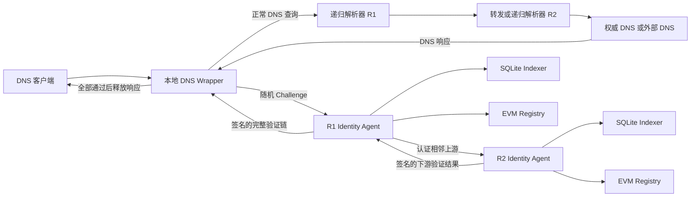
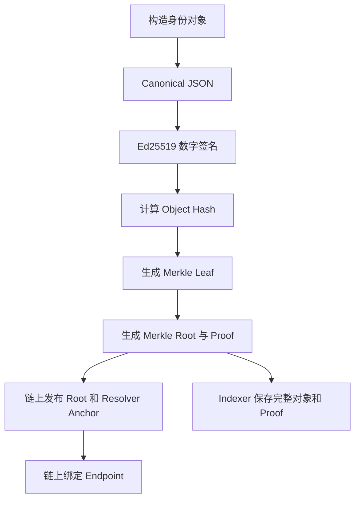

# 基于区块链带外身份索引的递归解析器身份认证系统

## 1. 项目概述

### 1.1 研究背景

在传统 DNS 查询过程中，客户端通常只知道自己把查询请求发送给了某个 IP 地址和端口，但这并不能充分说明该地址背后运行的解析器是谁、由谁运营、是否仍然具备合法身份，也不能说明实际查询链路中后续使用的转发解析器是否经过登记。

现有 DNS 安全机制大多关注域名记录本身，例如验证 DNS 数据是否被篡改，但对于“本次查询实际使用了哪些递归解析器或转发解析器”“这些解析器是否为预先登记且当前有效的节点”等问题，传统 DNS 协议并没有直接提供统一的认证方法。

本项目围绕解析器身份问题，设计并实现了一套基于区块链带外身份索引的递归解析器身份认证系统。系统不修改 DNS 协议、DNS 报文格式和操作系统网络栈，而是在应用层增加本地 DNS 验证封装器，并通过链下身份索引、数字签名、Merkle 证明和链上可信锚，对 DNS 查询链路中的递归解析器和转发解析器进行身份认证。

### 1.2 项目目标

系统主要解决以下问题：

1. 判断客户端当前连接的第一跳递归解析器是否为已登记的合法解析器；
2. 判断递归或转发链路中的后续解析器是否具有真实、有效且未撤销的身份；
3. 在不改变正常 DNS 查询方式的前提下，将解析器身份认证结果作为 DNS 响应是否可以释放的依据；
4. 在身份对象更新、解析器撤销、状态根撤销或链上发生重组时，及时使本地可信缓存失效；
5. 提供可以运行的本地 Web3 多解析器测试环境，以及面向单机部署的生产基线。

项目采用如下信任前提：

> 当一个递归解析器或转发解析器的身份真实、合法、处于有效期内且未被撤销时，系统假定该解析器会按照预期执行 DNS 协议，并返回它希望返回的 DNS 结果。

因此，本项目认证的是解析器身份和链路成员，而不是再次验证 DNS 记录内容是否正确。

### 1.3 系统定位

当前仓库已经形成完整的研究原型，主要包括：

- 应用层本地 DNS Wrapper；
- Resolver Identity Agent；
- SQLite Indexer；
- EVM 智能合约 Registry；
- Web3 链上访问后端；
- Ed25519 身份签名与逐请求 challenge；
- Merkle proof 与链上 state root；
- 可信缓存和链上事件监听；
- UDP、TCP DNS 和本地 DoH 接口；
- Docker Compose 多解析器端到端测试环境；
- 单机生产部署配置、安全边界和运维文档。

从项目完成度看，核心身份认证闭环已经实现，适合用于论文实验、系统演示和进一步的工程化验证。当前版本仍以单机 SQLite 为主，尚不具备多机数据库、高可用和水平扩展能力。

---

## 2. 系统总体架构

### 2.1 双链路设计

系统始终保留两条相互独立的链路：

- **正常 DNS 查询链路**：负责获取原始 DNS 响应；
- **带外身份认证链路**：负责认证查询过程中使用的递归解析器和转发解析器。

正常 DNS 查询报文不携带身份认证信息，身份认证也不依赖 DNS 响应中的附加字段。两条链路并行执行，最后在本地 Wrapper 处汇合。



Wrapper 会暂存上游解析器返回的 DNS 响应。只有身份认证链路成功，而且相关缓存和链上状态在释放前仍然有效时，Wrapper 才把原始响应返回给客户端。任何身份对象缺失、签名错误、端点不匹配、状态过期、解析器撤销、Agent 不可用或链路验证失败，都会使 Wrapper 返回 `SERVFAIL`。

### 2.2 逐跳分布式认证

Wrapper 只直接认证第一跳解析器 R1，不越过 R1 直接控制或查询所有后续解析器。后续链路采用逐跳分布式认证：

1. Wrapper 从 Indexer 中获取 R1 的身份对象；
2. Wrapper 检查 R1 的签名、Merkle proof、链上 anchor、endpoint binding 和 root status；
3. Wrapper 从已经通过认证的 R1 身份对象中读取 R1 Agent 的 Ed25519 公钥；
4. Wrapper 向 R1 Agent 发送本次请求的随机 challenge；
5. R1 Agent 认证自己的相邻上游 R2，并签名 `R1 → R2` 的验证结果；
6. 如果 R2 后面还有递归上游，R1 Agent 调用 R2 Agent；
7. R2 Agent 认证 R3，并返回签名的下游链；
8. 各级验证结果按照 `R3 → R2 → R1 → Wrapper` 的方向汇总；
9. Wrapper 验证每一级签名、身份继承关系、链路完整性和最终状态。

这种方式把每个 Agent 的责任限制在自己的相邻上游，避免由一个中心 Wrapper 直接替代所有解析器完成远程认证。

### 2.3 主要组件

| 组件 | 主要作用 |
|---|---|
| Local Wrapper | 接收 DNS 请求、并行转发查询和身份验证、决定是否释放响应 |
| ResolverVerifier | 验证身份对象、签名、链上锚点、Merkle proof、状态和端点绑定 |
| Resolver Identity Agent | 声明本机解析器身份和上游配置，认证相邻上游并签名验证链 |
| SQLite Indexer | 保存完整身份对象、索引、Merkle proof、缓存、审计和运行状态 |
| EVM Registry | 保存 object hash、state root、版本、状态和 endpoint binding |
| AdminPublisher | 生成并发布身份对象、root、resolver anchor 和端点绑定 |
| EventWatcher | 监听链上事件，处理撤销、更新、漏事件和链重组 |
| Trusted Cache | 缓存已经通过验证的身份结果，降低重复查询开销 |

---

## 3. 身份数据与信任基础

### 3.1 解析器身份对象

系统使用 `ResolverAuthenticityObjectV1` 表示一个递归解析器或转发解析器的完整身份。对象中包含的主要信息包括：

- `resolver_id`：解析器的唯一身份标识；
- `resolver_type`：解析器类型；
- `operator`：运营者标识、名称和信任域；
- `endpoints`：IP 地址、端口、传输协议、服务名、URI、SNI 和 ALPN 等；
- `valid_from` 与 `valid_until`：身份有效期；
- `status`：身份对象状态；
- `object_version`：对象版本；
- `issuer` 与 `key_id`：签发者和签名密钥标识；
- `attestation.agent`：与该解析器绑定的 Agent Ed25519 公钥；
- `signature`：签发者对身份对象的数字签名。

身份对象在签名前会转换为规范化 JSON，避免字段顺序、空格和编码差异导致哈希值不一致。

### 3.2 对象发布过程

解析器身份对象的发布过程如下：



链上主要保存摘要和状态，完整 JSON 对象保存在链下 Indexer 中。这样既可以减少链上存储开销，也可以通过链上的 object hash 和 state root 判断链下对象是否被修改。

### 3.3 链上 Registry

Solidity 合约 `ResolverIdentityRegistryV1` 保存以下核心数据：

- Resolver ID 的哈希键；
- 身份对象哈希；
- State root；
- 对象版本；
- 有效截止时间；
- 解析器状态；
- Root 状态；
- Endpoint 到 Resolver ID 的绑定关系。

合约定义了多个权限角色：

- `DEFAULT_ADMIN_ROLE`：管理其他角色；
- `ROOT_PUBLISHER_ROLE`：发布状态根；
- `RESOLVER_PUBLISHER_ROLE`：发布和更新解析器；
- `ENDPOINT_MANAGER_ROLE`：绑定和解绑端点；
- `REVOKER_ROLE`：撤销解析器或状态根。

生产模式中的 Web3 后端会固定并检查 chain ID、合约地址和 runtime code hash，避免服务连接到错误链或错误合约。

### 3.4 Agent 的可信来源

Agent 不能通过“自己提交一个公钥”来证明自己可信。Agent 公钥必须预先绑定在已经通过验证的解析器身份对象中。

以 R1 为例，Wrapper 的信任建立顺序是：

1. 先认证 R1 endpoint 对应的解析器身份对象；
2. 从该对象的 `attestation.agent.public_key` 中读取 Agent 公钥；
3. 使用该公钥验证 R1 Agent 返回的身份信息和 VerificationChain；
4. R1 对 R2 的 hop evidence 中携带 R2 Agent 公钥；
5. Wrapper 只有在 R2 已被 R1 的签名 hop 正确引入后，才接受 R2 Agent 对下游链的签名。

这形成了一条从链上身份锚点到各级 Agent 的公钥信任链。

---

## 4. 核心运行流程

### 4.1 DNS 查询处理

客户端向 Wrapper 发送 DNS 查询后，系统执行以下步骤：

1. Wrapper 为请求生成唯一 request ID 和随机 challenge；
2. Wrapper 启动正常 DNS 转发任务；
3. Wrapper 同时启动解析器链路发现和身份认证任务；
4. 第一跳解析器返回 DNS 响应后，Wrapper 先在内存中保存该响应；
5. ResolverVerifier 验证 R1 身份；
6. Wrapper 调用 R1 Agent 获取受 challenge 绑定的 VerificationChain；
7. Wrapper 验证每个 hop、每个 downstream chain 和整体 final result；
8. 在响应释放前，再检查验证结果对应的缓存状态是否仍然有效；
9. 全部条件成立时返回原始 DNS 响应；
10. 任一条件失败时返回 `SERVFAIL`。

正常查询和身份认证并行执行，可以减少身份验证直接叠加在 DNS 查询后的串行等待时间。

### 4.2 单个解析器端点的认证

`ResolverVerifier` 对端点执行的主要检查顺序如下：

1. 对 IP、端口、传输协议、服务名等信息规范化；
2. 计算 endpoint lookup key；
3. 查询本地可信缓存；
4. 缓存未命中时，从 Indexer 查找对应 Resolver ID；
5. 检查链上 endpoint binding 是否指向该 Resolver ID；
6. 读取链上 Resolver Anchor；
7. 检查 Resolver 链上状态；
8. 获取 Indexer 中的完整身份对象；
9. 重新计算 object hash；
10. 比较本地元数据中的 hash 和链上 hash；
11. 检查 object version；
12. 验证签发者 Ed25519 签名；
13. 检查 state root 是否处于 ACTIVE 状态；
14. 根据 Resolver ID、object hash、版本和状态重新计算 Merkle leaf；
15. 验证 Merkle proof；
16. 检查身份对象的有效期和语义；
17. 检查当前端点是否确实包含在身份对象中；
18. 在写入缓存前重新读取 Registry，防止验证过程中发生撤销或更新；
19. 将结果写入可信缓存。

常见的拒绝原因包括：

- `lookup_not_found`；
- `endpoint_binding_mismatch`；
- `chain_anchor_not_found`；
- `chain_status_not_active`；
- `signature_invalid`；
- `object_version_mismatch`；
- `merkle_proof_root_mismatch`；
- `endpoint_not_in_object`；
- `registry_changed_during_verification`；
- `out_of_band_unavailable`。

### 4.3 VerificationChain 验证

VerificationChain 不只是一个解析器列表，它由多层签名结构组成。每一级通常包含：

- 当前解析器 ID；
- 当前解析器 endpoint；
- Agent 配置版本；
- 本次请求 challenge；
- 相邻上游 hop 验证结果；
- 下游 Agent 返回的 VerificationChain；
- 明确声明的 terminal upstream；
- 链路错误列表；
- 最终验证结果；
- 签发时间、过期时间和 Agent 签名。

Wrapper 会检查：

- challenge 是否与当前 DNS 请求一致；
- Agent 签名是否可以由已绑定公钥验证；
- hop 的来源解析器和来源端点是否正确；
- downstream chain 是否由上一级已通过认证的 hop 引入；
- 是否存在孤立链、重复链或拼接链；
- 是否存在循环或超过最大深度；
- Agent 配置版本是否回滚；
- recursive hop 是否被错误声明为 terminal；
- `final_result` 是否与 hops、downstream chains 和 errors 一致。

### 4.4 缓存与撤销

可信缓存分为 cold path 和 hot path：

- **Cold path**：完整访问 Indexer、Registry、签名和 Merkle proof；
- **Hot path**：使用已经通过验证且仍处于有效期内的缓存结果。

缓存设置 soft TTL 和 hard TTL。达到 soft TTL 后可以触发刷新；达到 hard TTL 后，如果带外服务不可用，系统不再使用旧缓存，而是失败关闭。

EventWatcher 监听以下链上事件：

- `ResolverPublished`；
- `ResolverUpdated`；
- `ResolverRevoked`；
- `RootRevoked`；
- `EndpointBound`；
- `EndpointUnbound`。

解析器撤销、Root 撤销、对象更新或端点解绑都会使相关缓存失效。系统还记录区块游标和区块哈希，在发现链重组时先隔离现有缓存，再回滚游标重新处理链上事件。

---

## 5. 工程实现与部署方式

### 5.1 代码结构

仓库主要目录如下：

```text
contracts/                 Solidity 合约和 Foundry 测试
src/resolver_identity/     Python 核心实现
tests/                     单元、集成、安全和实验测试
tools/                     启动脚本、E2E 和运维工具
docs/                      API、安全边界、生产架构和运维文档
docker/                    镜像和本地运行状态目录
```

Python 核心代码按照功能划分为：

- `admin/`：身份对象构造、发布和管理 API；
- `agent/`：Agent 身份、逐跳验证和签名链；
- `chain/`：Registry 接口、Web3 后端和 EventWatcher；
- `crypto/`：规范化 JSON、哈希、签名和 Merkle proof；
- `db/`：SQLite schema 和 repository；
- `models/`：身份对象、端点和验证结果模型；
- `verifier/`：解析器身份验证和缓存策略；
- `wrapper/`：UDP/TCP DNS、DoH、查询协调和指标。

### 5.2 本地多解析器测试环境

仓库提供 Docker Compose 多解析器测试环境，主要服务包括：

- Anvil 本地 EVM；
- CoreDNS R1；
- CoreDNS R2；
- R1 Agent；
- R2 Agent；
- Indexer；
- EventWatcher；
- Local Wrapper。

E2E 脚本会自动完成：

1. 编译并部署 Registry 合约；
2. 生成 R1 和 R2 的 Ed25519 Agent 密钥；
3. 发布 R1、R2 的身份对象和 endpoint binding；
4. 启动多服务环境；
5. 通过 UDP 和 TCP 查询测试域名；
6. 验证正常情况下返回预期地址；
7. 验证身份缺失、Agent 不可用、签名错误、解析器撤销和 Root 撤销时返回 `SERVFAIL`。

基础运行命令：

```bash
python3 -m venv .venv
. .venv/bin/activate
pip install -e '.[dev,web3]'

python3 -m compileall src tests tools
python3 -m pytest tests -q
cd contracts && forge test -vvv
```

多解析器 E2E：

```bash
python3 tools/run_multi_resolver_e2e.py
```

### 5.3 单机生产部署基线

当前生产 profile 面向一台 Linux 主机，使用 Docker Compose 部署：

- Local Wrapper；
- R1 Agent；
- Indexer；
- EventWatcher；
- Admin API；
- 本地 SQLite volume；
- 外部 EVM JSON-RPC。

生产模式要求：

- `RESOLVER_IDENTITY_ENVIRONMENT=production`；
- 使用外部 EVM Registry；
- 固定 chain ID 和合约 runtime code hash；
- 禁用 HMAC 身份对象签名；
- 配置受信任的 Ed25519 issuer 公钥包；
- 强制使用分布式 Agent 验证；
- 为每次请求生成新的 challenge；
- 远程 Agent 使用 HTTPS，生产环境建议 mTLS；
- Admin API 只暴露在本机或管理网络；
- 私钥通过 Docker secrets 文件加载；
- 容器使用非 root 用户、只读文件系统并移除多余 capability。

当前 profile 不支持多台主机共享 SQLite，也不支持多个 Wrapper 同时写入同一个数据库。

---

## 6. 安全机制、实验与边界

### 6.1 Fail-closed 策略

系统使用严格的失败关闭策略。以下任一情况出现时，原始 DNS 响应不会被释放：

- 身份对象不存在；
- Endpoint 未绑定或绑定错误；
- 链上 anchor 不存在；
- Object hash 不一致；
- Ed25519 签名错误；
- 身份过期、暂停或撤销；
- Root 无效或已撤销；
- Merkle proof 无效；
- 当前 endpoint 不在身份对象中；
- Agent 公钥缺失；
- Agent、hop 或下游链签名错误；
- challenge 不一致或签名结果过期；
- 链路循环、超深或配置版本回滚；
- Indexer、Registry 或 Agent 不可用且没有仍然有效的缓存。

### 6.2 已覆盖的安全实验

仓库中的安全实验和测试覆盖了以下场景：

- Indexer 身份对象篡改；
- 旧版本身份对象重放；
- Merkle proof 替换；
- VerificationChain 跨请求重放；
- Agent 公钥替换；
- 下游链拼接和孤立链注入；
- 中间 Agent 链省略；
- Terminal boundary 注入；
- 伪造不存在的下游 hop；
- Resolver 和 Root 撤销；
- EVM 链重组；
- Agent 配置版本回滚；
- 查询与撤销并发竞争。

仓库现有实验报告记录的结果包括：

- Python 测试 121 项通过；
- 分支覆盖率约 71%；
- Foundry 合约测试 14 项通过；
- Docker Compose 配置检查通过；
- Web3 多解析器 E2E 通过；
- 13 类安全攻击实验按预期失败关闭。

这些结果属于仓库中记录的本地执行结果。正式发布时仍应通过 GitHub Actions、预生产环境和独立复现实验再次确认。

### 6.3 明确的安全边界

本项目不研究或不直接解决以下问题：

- 已合法登记解析器被攻破；
- 合法解析器配置错误；
- 合法运营者主动返回错误结果；
- 权威 DNS 记录本身错误；
- DNSSEC 数据验证；
- 权威服务器、根服务器或 TLD 服务器身份认证；
- TPM、TEE、远程证明和查询执行证明；
- 证明某个解析器确实按照 Agent 声明的路径转发了特定查询；
- 自动发现互联网上不可观测或不合作的隐藏中间解析器。

因此，系统能够证明的是“当前可观测链路由哪些已认证解析器组成”，而不是“DNS 结果在语义上绝对正确”。

---

## 7. 当前完成情况与后续方向

### 7.1 已经完成的能力

当前项目已经完成以下核心功能：

- 解析器身份对象和版本模型；
- Canonical JSON、Object Hash 和 Lookup Key；
- Ed25519 身份签名和验签；
- Agent 公钥与解析器身份对象绑定；
- Solidity Registry 合约；
- Web3 链上读写和合约代码哈希固定；
- SQLite Indexer；
- ResolverVerifier 完整认证流程；
- Merkle proof 验证；
- Endpoint binding；
- 可信缓存、TTL 和撤销代次；
- EventWatcher、Reorg 检测和状态对账；
- UDP/TCP DNS Wrapper 和本地 DoH；
- R1、R2、R3 逐跳 Agent 认证模型；
- Challenge 防重放；
- Docker Compose 多解析器 E2E；
- 单机生产 Compose、安全配置和运维工具；
- 单元测试、集成测试、合约测试和安全实验。

从研究原型角度看，核心系统闭环已经形成：

```text
身份登记与发布
    ↓
链下保存完整身份对象
    ↓
链上保存可信摘要和状态
    ↓
DNS 查询与身份认证并行执行
    ↓
逐跳验证解析器链路
    ↓
全部通过后释放 DNS 响应
```

### 7.2 当前不足

当前仍有以下工程限制：

1. 生产 profile 只支持单机 SQLite；
2. 不支持多主机共享、数据库集群和水平扩容；
3. 生产部署文档主要是基线和模拟执行说明，尚缺真实链、真实证书和真实流量的部署证据；
4. Operator 管理和独立 Endpoint 管理 API 尚未完整实现；
5. 默认发布流程主要以单个身份对象生成 Merkle root，尚未形成完整的批量状态树发布服务；
6. 尚缺面向实际目标 QPS、链路深度和故障场景的正式容量报告；
7. 高可用模式下需要使用事务型数据库和持久事件队列替换单机 SQLite 方案。

### 7.3 建议的后续工作

后续工作可以优先围绕以下方向展开：

- 实现批量身份对象构树和统一 state root 发布；
- 完成真实 EVM 测试网或联盟链部署；
- 使用真实 CA 完成 Agent TLS/mTLS；
- 增加不同并发量、链路深度和缓存命中率下的性能实验；
- 增加 PostgreSQL 等事务数据库后端；
- 支持 Wrapper 和 Indexer 多实例部署；
- 完善 Operator、Endpoint 和密钥轮换管理；
- 将 GitHub Actions 运行结果、SBOM、镜像 digest 和实验数据作为正式发布证据；
- 根据论文需要，将系统开销与不进行身份认证的普通 DNS 路径进行对照实验。

总体而言，本项目已经具备较清晰的研究问题、完整的技术链路和可以运行的实现。它的主要价值在于：在保持现有 DNS 协议兼容性的前提下，把区块链可信锚、链下身份索引和解析器侧 Agent 结合起来，为递归解析器和转发解析器提供一套可验证、可撤销、可审计的身份认证机制。